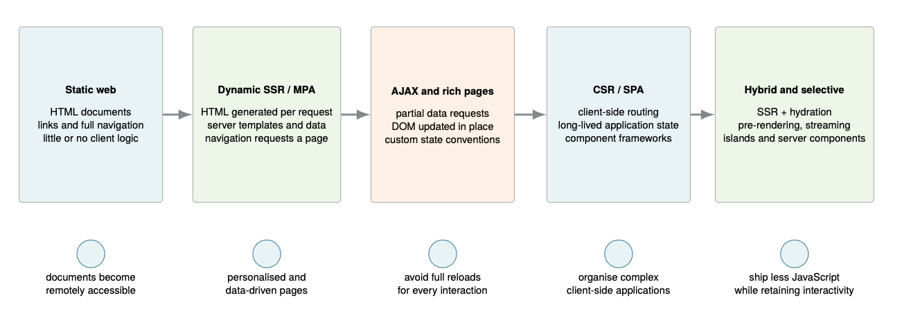
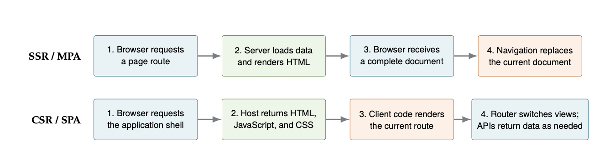
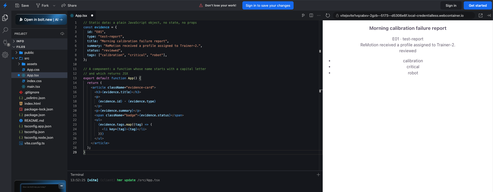

# Exercise 3 — React Foundations & First Migration

This is the third exercise in Advanced Web Engineering Course (CSDC). It builds on Exercises 1 and 2. This exercise adds
React to that project and migrates the **application shell and one representative view (the Dashboard)** to it. The rest of the app stays vanilla TS for now. You'll migrate more of it in Exercises 4 and 5.

Keep a running note of what you changed and why, and commit as you go. Several theory questions ask you to point at a specific decision or diff you made.

## Corresponding manuscript reading

This exercise corresponds to the following chapters in the course manuscript:

- **Chapter 12, From Static Documents to Rich Web Applications** — PDF pp. 85–88
- **Chapter 13, Rendering and Navigation Architectures** — PDF pp. 90–95
- **Chapter 14, Hybrid Rendering and Modern Web Architectures** — PDF pp. 96–100
- **Chapter 15, React Foundations** — PDF pp. 102–109

## Self-Check

The exercise is organized into 10 individual tasks with corresponding questions, that are
presented in class. 

These checkboxes are for self-checking. Don't forget to do the actual checking of tasks you are able to present in the Moodle course. **Before class, tick only what you can genuinely demonstrate or answer on the spot, live.**

| # | Demo | Ready? |
|---|---|---|
| 1 | Historical view of the web | ☐ |
| 2 | SSR vs. CSR | ☐ |
| 3 | The virtual DOM | ☐ |
| 4 | SPA vs. MPA: state & routing | ☐ |
| 5 | React introduction | ☐ |
| 6 | React + TypeScript entry point in the Vite project | ☐ |
| 7 | Component hierarchy for the whole app | ☐ |
| 8 | Architecture Decision Record: why SPA/React | ☐ |
| 9 | Migrate the application shell | ☐ |
| 10 | Migrate the Dashboard view | ☐ |

A demo only counts as "Ready" once **every** task and question checkbox inside it (below) is
ticked — the table above is just a fast overview, tick the boxes inside each demo first.

---

## Demo 1 — Historical view of the web

**Tasks**

- [x] Give a concise explanation of how web applications evolved over the years and place the app from the exercises on the timeline. Justify where you put it.

    Web applications evolved in stages, and each stage fixed a limitation of the one before. 
   
    - **Static:** prepared HTML files linked together, with a full page load for every click.
    - **Dynamic SSR / MPA:** HTML generated per request from templates and data, so pages can be personalised, but every navigation is still a full document reload.
    - **AJAX:** JavaScript fetches data in the background and updates part of the page.
    - **CSR / SPA:** rendering and navigation move into the browser, which loads one application shell.
    - **Hybrid:** SSR with hydration, streaming and similar techniques combine server and client rendering.

    No stage fully replaced the earlier ones. They're a growing set of strategies with different trade-offs.

    

    I'd place my app at the CSR / SPA stage of the evolution. The server only sends an empty application shell (`index.html` with empty containers like `#dashboardContent`), and JavaScript fetches the JSON files and builds every view in the browser. It's a single page because the browser loads one document and my hash router (`handleHashChange()`) switches views without reloading it, so the data and state stay in memory. It has no framework, so I update the DOM by hand with `innerHTML` and manage state in a global `state` object, which is why it still shows the problems of the AJAX stage. That's why it makes sense to migrate it to React.
    
    TLDR: the server sends an empty shell, the browser builds all the content, and one document handles all navigation, so it's CSR / SPA.
    

**Questions** (depend on the tasks above)

- [x] What specific problem was AJAX (and libraries like jQuery) solving that plain server-rendered pages couldn't? What new problems did that approach introduce, that SPA frameworks then tried to solve?

    **The problem AJAX solved:** in a server-rendered page, every interaction that needed server data meant a full document request. The browser threw away the current page and its temporary state and loaded a new one. AJAX let JavaScript request just the data it needed in the background and update only one part of the page. jQuery made this practical by smoothing over browser differences in DOM selection, event handling and network requests.

    **The new problems:** the browser now held real application state, and updates were scattered across event handlers and selectors. It became hard to answer:

    - which data is authoritative,
    - which parts of the page depend on that data,
    - which request result is still relevant,
    - which handler has to run after which,
    - and how navigation and history represent the current view.

    **Examples from my app:**

    - *Which request result is still relevant?* When I search the evidence, a slow response for an old search could arrive after a newer one and overwrite it. In `evidence.ts` I solve this with `state.latestSearchRequestId`: each search increments it, and a response is ignored if its request id is no longer the latest.

    - *Which parts of the page depend on the data?* The dashboard shows the bookmark count, but it only renders on the first visit (the `viewRendered.dashboard` flag in `router.ts`). Bookmarking an item afterwards leaves the dashboard showing old numbers, because nothing links the data to the screen.

    **What SPA frameworks added:** the manuscript describes frameworks as a systematic answer to this. Application state changes, and the visible interface follows that state consistently, instead of me updating the DOM by hand in every handler. Patterns like MVC and MVVM separated the data, the view and the update logic.

- [x] This app currently uses hash-based routing (`#dashboard`, `#evidence`, ...) with no full page reload between views. Which era does that pattern belong to, and what does it tell you about when this architectural choice became common?

    **Which era:** hash routing belongs to the CSR / SPA stage. In an MPA, every view is a separate document request. In my app the browser loads one document (`index.html`), and changing the part of the URL after `#` switches the view in JavaScript. A `hashchange` listener calls `handleHashChange()`, which shows the matching view section and hides the others. The fragment after `#` is never sent to the server, so no request happens and the page isn't reloaded.

    **What it tells me about when it became common:** it became common once the browser, not the server, was responsible for navigation, which is the shift to SPAs. Hash routing is the simplest way to do this, because a static host can keep returning the same document while the client code interprets the hash. The manuscript describes the History API as the other technique. It gives clean paths like `/dashboard`, but the server then has to return the app's entry document for those paths, because a direct request still reaches the server first. So my choice fits an app with no server logic that's deployed as static files (GitHub Pages). I wouldn't call it outdated. It's the simpler of two techniques that are both in use.

    **Limits of my version:** my router is hand-written. It handles the back button and reloading a view (`#evidence` returns to the evidence view), so my routes are bookmarkable and shareable. It doesn't handle things a real router does, such as route parameters, nested views, or a proper "not found" page. An unknown hash just falls back to the dashboard.

---

## Demo 2 — SSR vs. CSR

**Tasks**

- [x] Present a short comparison table for Server-Side Rendering and Client-Side Rendering. Explain what the server sends on first request, what the browser has to do before the user sees content, and what happens on subsequent navigation.

    | | Server-Side Rendering (SSR) | Client-Side Rendering (CSR) |
    |---|---|---|
    | **Where the HTML is produced** | On the server, for each request | In the browser, by JavaScript |
    | **What the server sends on the first request** | A complete HTML document with the real content already in it | A small HTML shell (empty containers) plus references to JavaScript and CSS |
    | **What the browser does before the user sees content** | Parses the HTML and displays it. JavaScript is optional. | Downloads and parses the shell, downloads and runs the JavaScript, initialises routing and state, fetches the data, then builds the DOM |
    | **Subsequent navigation** | Typically another request. The server returns a new document and the browser replaces the current one. | The router changes the view in the same document. Only data is requested, and no new HTML document is loaded. |
    | **Main strength** | Meaningful content in the first response, works with little or no JavaScript | Fast transitions after start-up, state can stay in browser memory |
    | **Main cost** | A server round trip and full replacement for each navigation | More work and waiting before the first view appears, and it depends on JavaScript |

    SSR/CSR is about *where* the view is rendered. MPA/SPA is about *how navigation is organised*. They are different axes and can be combined (manuscript, section 13.1).

    

- [x] Pick one real, publicly known website and argue whether it's (primarily) SSR or CSR, using observable evidence (view source, network tab, etc.).

    **Website:** Wikipedia, my arguement: it is **primarily SSR**.

    **Evidence:**
    - *View source:* when I open the page source (`Ctrl+U`), the article text, headings and links are already in the HTML the server sent. I can search the source for a sentence from the article and find it.
    - *Network tab:* when I reload with the Network tab open, the very first request, of type `document`, is the article HTML, and its response already contains the content. There is no empty shell waiting for a JSON request to fill it in.
    - *Navigation:* when I click a link to another article, a new `document` request appears in the Network tab and the whole page is replaced. That's the MPA behaviour of full-document navigation.

    Wikipedia does use some JavaScript for interactive parts such as search suggestions, so it isn't purely server-rendered, which is why I say "primarily".


**Questions** (depend on the tasks above)

- [x] Explain why this exercise application is SSR or CSR and why. Walk through, step by step, what happens between the browser requesting the page and the Dashboard actually being visible.

    My app is **client-side rendered (CSR)**, and it's also an SPA, because navigation happens inside one document. The server only sends a static `index.html`. All the case data (evidence, people, timeline) is loaded and turned into HTML by JavaScript in the browser.

    **Step by step:**

    1. The browser requests the page, and the server returns `index.html` as a static file. It contains the header, the navigation, the intro card, a visible loading overlay ("Loading case file…") and an **empty** `<div id="dashboardContent">`. None of the case data is in it.
    2. The browser parses the HTML and finds the stylesheet and the `<script type="module">` tag, then downloads the CSS and the JavaScript.
    3. The JavaScript runs. `main.ts` registers the view renderers, and when the page is ready `initApp()` loads bookmarks and notes from `localStorage` and sets up the event listeners.
    4. `loadAllData()` fetches the data files. It requests `case.json`, `people.json` and `locations.json` one after another, then `evidence.json` and `timeline.json`. `renderDashboard()` is called as each part arrives, so the numbers fill in progressively.
    5. `handleHashChange()` reads the URL hash (no hash means the dashboard), marks the dashboard section as active, and `renderDashboard()` builds the HTML as a string and assigns it to `#dashboardContent` with `innerHTML`.
    6. Once both loading steps have finished, the loading overlay is hidden and the Dashboard is visible.

    Manuscript's description of CSR: the browser has to download the shell, then the JavaScript, run it, initialise routing and state, fetch the data and create the DOM before the first real view exists.

- [x] Name one real cost of what the architecture pays for that choice (think about what a user with JavaScript disabled, or a slow connection, or a search engine crawler would see) and why.

    **The main cost is that nothing useful is visible until JavaScript has loaded, run and fetched the data.**

    - *JavaScript disabled:* the user sees only the static shell. The loading overlay never goes away, because only JavaScript hides it. None of the views are shown, because no view gets the `active` class without JavaScript.
    - *Slow connection:* the user waits for the HTML, then the JavaScript, and then for the JSON files, which my code requests one after another. The loading spinner is shown for that whole time. A server-rendered page could show content as soon as the first response arrived.
    - *Search engine crawler:* a crawler that doesn't run JavaScript only sees the header, navigation and intro text. The case data never appears in the HTML it receives, so it can't be indexed.

    **Why:** this is the cost of moving rendering into the browser. It's the "more code and data required before first interaction" trade-off from the manuscript. In return, navigation between views is fast and doesn't reload the page, and the state (bookmarks, filters) stays in memory.

---

## Demo 3 — The virtual DOM

**Tasks**

- [x] In your own words (a few sentences, not a copied definition), explain what the virtual DOM is and what problem it solves.

    The virtual DOM is a lightweight description of what the UI should look like, kept in memory as plain JavaScript objects. It isn't a copy of the browser's DOM. It has no layout or styles and can't dispatch events. When the state changes, React calls my components again to calculate a new description, compares it with the previous one (reconciliation), and then changes the real DOM only where the two descriptions differ (commit).

    The problem it solves: when I update the page by hand, I have to decide which DOM nodes to change after every state change, or throw away a big chunk of the DOM and rebuild it. With a virtual DOM I only describe what the UI should look like for the current state, and React works out the smallest set of real DOM changes needed.

- [x] Find one concrete example in the *original* vanilla `app.js` (from before Exercise 1) where a small state change (e.g. toggling one bookmark) caused a large chunk of real DOM to be recreated via `innerHTML`, even though only a tiny part of it actually needed to change.

    **Example: toggling one bookmark in the Evidence view.**

    - Clicking the star calls `handleBookmarkClick(evidenceId)` (about line 434). It flips one item: it adds or removes the id in `bookmarks`, sets `ev.bookmarked`, and saves to `localStorage`.
    - Then, on the last line of the function, it calls `renderEvidenceList()`.
    - `renderEvidenceList()` (about line 369) builds an HTML string for **every** evidence card by calling `renderEvidenceCardHTML()` in a loop. It then assigns that string to `container.innerHTML` (about line 390).

    **What actually needed to change:** one star icon (☆ to ★) and one CSS class (`active`) on one button. **What got recreated:** all 18 evidence cards, as new DOM nodes parsed from a string. The old nodes are thrown away, along with anything the browser held on them, such as focus on the button I just clicked.


**Questions** (depend on the tasks above)

- [x] Using the example you found: how would a virtual-DOM-based approach (conceptually, not necessarily React-specific) avoid recreating the parts that didn't change?

    With a virtual DOM, toggling the bookmark would only change the state (the `bookmarks` list). The UI is then recalculated as a new in-memory description: 18 cards, where the new description differs from the old one in only one place, a single card's star and class. The library compares the old and new descriptions (reconciliation) and sees that 17 cards are identical. It then applies one small change to the real DOM, updating the star and the class on one button. The other 17 cards stay as the same DOM nodes.

    To match cards between renders, the library uses component types, positions and keys. For a list like this each card would need a stable key, such as the evidence id.

- [x] Is the virtual DOM a "faster" way to update the real DOM than directly calling `innerHTML`? Explain precisely what's actually being traded off (think about the diffing work itself).

    Not automatically. The virtual DOM adds work: React has to call the components again to build the new description, and then compare it with the old one. That is extra JavaScript, and it is not free. The manuscript calls the virtual DOM "an accounting model, not a speed guarantee".

    **What is being traded off:**
    - *With `innerHTML`:* there is no diffing work, but the browser has to parse the HTML string and create all the nodes again, and the old nodes are destroyed along with their state (focus, text typed into inputs, event listeners). For a small, simple area this can even be faster than a virtual DOM.
    - *With a virtual DOM:* more JavaScript work to calculate and compare, in exchange for a minimal, targeted set of real DOM changes, and nodes that stay alive.

    The real benefit is that I can write the UI declaratively (describe it as a function of the state) while the library takes care of updating the DOM correctly. Speed is a side effect that depends on the case.

- [x] Does using a virtual DOM library automatically make your app fast? What could still make a React app slow despite it?

    No. The manuscript lists several things that can still make a React app slow:

    - components that do expensive calculations while rendering,
    - state that is owned too high in the component tree, so large parts of the tree re-render when it changes,
    - large lists that re-render unnecessarily (for example without proper keys),
    - effects that create repeated network requests,
    - and costly layout and painting in the browser, which the virtual DOM doesn't change.

    In my app, for example, if the whole Evidence list were driven by state held at the very top, every bookmark toggle would still re-run all the card components, even if React only commits one change to the DOM.

---

## Demo 4 — SPA vs. MPA: state & routing

**Tasks**

- [x] Diagram or illustrate live how navigation currently works in this app: what triggers a view change, what code runs, and what does *not* happen (that would happen in a classic multi-page site).

```text
    User clicks a nav button, e.g. "Evidence"
      │   (index.html: onclick="navigateTo('evidence')")
      ▼
    navigateTo('evidence')                         router.ts
      │   sets window.location.hash = "evidence"
      ▼
    Browser fires the "hashchange" event           (no request, no reload)
      │
      ▼
    handleHashChange()                             router.ts
      ├─ reads the hash and checks it is a valid view name (unknown → "dashboard")
      ├─ sets state.currentPage
      ├─ removes .active from all .view sections, adds it to #view-evidence
      ├─ moves .active to the matching nav button
      └─ renders the view if it hasn't been rendered yet (viewRendered flag)
```

    **What does *not* happen (but would in a classic multi-page site):**
    - No request for a new HTML document, and the server isn't involved at all.
    - No page reload: the JavaScript keeps running and the `state` object stays in memory.
    - No re-download of the CSS, JavaScript or JSON data.
    - No white flash or loading indicator from the browser.


- [x] List every piece of state in the current app that would be lost on a full page reload, versus what's preserved (hint: check what's in `localStorage` versus what's only in memory).

    | Preserved after a reload | Lost on a reload (in memory only) |
    |---|---|
    | Bookmarks (`localStorage`, key `remotion_bookmarks`) | `state.allEvidence`, `allPeople`, `allLocations`, `allTimeline`, `caseData` (re-fetched from the JSON files) |
    | Notes (`remotion_notes`) | `state.filteredEvidence` and the search and filter selections |
    | Saved hypothesis (`remotion_hypothesis`) | `state.selectedEvidence` (the evidence detail that is open) |
    | The current view, because it is in the URL hash (`#evidence`) | `state.currentPeopleTab` (People vs. Locations tab) |
    | | `state.viewRendered` flags, `latestSearchRequestId`, `loadingStepsRemaining` |
    | | Anything typed but not yet saved (a note or the hypothesis form) |

    `state.currentPage` is also lost, but it's rebuilt right away from the URL hash.


**Questions** (depend on the tasks above)

- [x] In a traditional multi-page app, where does "the current page's data" live between requests? Where does it live in this SPA instead, and what are the consequences of that difference (for good and for bad)?

    **In a multi-page app**, the data lives on the server (database, session). The server reads it and puts it into a new HTML document for every request. The browser keeps nothing between requests except what is encoded in the URL, form submissions, cookies, sessions or persistent storage. Temporary browser memory is discarded on each navigation.

    **In my SPA**, the data lives in the browser, in the global `state` object. It's fetched once from the JSON files and then kept in memory while the page is open.

    **Good:**
    - Navigation is fast. Switching views doesn't reload or refetch anything.
    - UI state survives navigation, for example the evidence filters when I go to another view and back.

    **Bad:**
    - Everything in memory is lost on a reload, so anything that must persist has to be saved on purpose (`localStorage`).
    - The data can go stale or disagree with the screen. My dashboard showing old numbers because of `viewRendered` is an example.
    - The data has no clear owner. I have to manage and synchronise it myself, which is what long-lived client applications make hard.

- [x] This app currently implements routing by hand (`handleHashChange()`, a `switch`-like chain of `if`s, and manually toggling CSS classes). What is a router library actually responsible for that this hand-rolled version does *not* handle?

    The manuscript lists what a client router typically handles. Here is how my version compares:

    - **Path matching, including dynamic paths** (like `/evidence/E05`): mine only matches a fixed view name, with no parameters.
    - **Nested layouts and child routes:** not supported. My routes are a flat list of five.
    - **Route and query parameters:** none. For example, the evidence detail that is open is not in the URL, so it can't be bookmarked or shared, and it's lost on a reload.
    - **Redirects and missing routes:** my fallback silently shows the dashboard for an unknown hash, but the URL still says `#nonsense`. The URL and the rendered view disagree, and there's no proper "not found" page.
    - **Links that avoid full navigation:** I use `onclick` handlers on buttons, not real links.
    - **Coordination between URL state and rendered state:** I toggle `.active` classes by hand and have to keep the nav buttons and the sections in sync myself.

    What mine does handle is the basic mapping of the hash to a view, plus Back and Forward (see the next question).

- [x] If the user hits the browser's back button right now, what happens in this app, and why?

    The app goes back to the previous view, and there's no page reload. Every nav click sets `window.location.hash`, and changing the hash adds a new entry to the browser's history. When the user presses Back, the browser moves to the previous history entry, which changes the hash back and fires the `hashchange` event. My `handleHashChange()` then runs and shows the matching view.

    It works because each view has its own hash, so each navigation creates a history entry. It would not work for things that aren't in the URL: opening an evidence detail doesn't add a history entry, so Back skips over it and goes to the previous view. If the user goes back past the first entry, they leave the app.

---

## Demo 5 — React introduction

**Tasks**

- [x] Read enough of the React docs (or equivalent) to write, from scratch, a single tiny component (it can live in a throwaway sandbox, not necessarily this project yet) that renders a piece of static data as JSX. No state, no props even, just to prove you can write and reason about JSX.

    I wrote a component in a Vite + React + TypeScript sandbox that renders one evidence item from a static object (id, type, title, summary, status and a list of tags). The component is a function, `App`, that returns JSX. It reads the data with `{evidence.title}`-style expressions and renders the tags with `.map()`, giving each `<li>` a `key`. It has no state and no props.

    

- [x] Identify, in your own words, what "component" means in React, and how it differs from a plain JavaScript function that happens to return an HTML string (which is essentially what several functions in the old `app.js` did, e.g. `renderEvidenceCardHTML()`).

    A React component is a function that takes inputs (props, and state if it has any) and returns a **description of the UI** in JSX. React calls the component, and React decides when and how that description becomes real DOM. A component is also a unit with an identity: it can be reused, placed in a tree with other components, and React can keep track of it between renders.

    A plain function like `renderEvidenceCardHTML(ev)` just returns a **string**. The string has no structure the program can inspect, and no identity. The browser only learns about it when I assign it to `innerHTML`, which parses it and replaces everything inside the container. Nothing keeps track of which part of the string came from where.

    **Differences:**
    - *Output:* a React element (a structured description) vs. an HTML string.
    - *Who updates the DOM:* React, for only what changed, vs. me, by replacing everything with `innerHTML`.
    - *Safety:* JSX escapes values by default, while string concatenation inserts raw text into HTML (some of my vanilla code is deliberately unsafe in this way).
    - *Composition:* components can contain other components, with typed props as their contract. A string function can only be called and concatenated.

**Questions** (depend on the tasks above)

- [x] What is JSX, actually? What does it compile to?

    JSX is a syntax extension of JavaScript that lets me write UI descriptions that look like HTML inside JavaScript code. It's not HTML and not a string, and the browser can't read it directly. A build step (in my project Vite, with the React plugin) transforms it into plain JavaScript function calls that create **React elements**, which are immutable objects describing the UI.

    For example, `<h2 className="x">{record.title}</h2>` compiles to a call like `jsx("h2", { className: "x", children: record.title })`. (Older setups use `React.createElement("h2", { className: "x" }, record.title)`.) The result is a plain JavaScript object, not a DOM node, and React uses these objects to work out what to show.

- [x] Compare your tiny component to the old `renderEvidenceCardHTML(ev)` function (string concatenation returning an HTML string). What is fundamentally different about how each one's output becomes real DOM?

    **`renderEvidenceCardHTML(ev)`** returns a string such as `'<div class="evidence-card">...'`. It becomes real DOM only when I assign it to `container.innerHTML`. The browser then parses the string, creates all the nodes, and discards the old ones. The result is a fresh set of nodes every time.

    **My component** returns a React element, an object that describes the UI. React turns it into real DOM on the first render. After that, when the data changes, React compares the new description with the old one and updates only the parts of the DOM that differ. The existing nodes stay alive.

    So the difference is *who is in control of the DOM and how*: with the string function I replace whole chunks, and with the component I describe the result and React applies the minimal changes.

- [x] What does it mean that "components are just functions" in React? What would break if a component's function body had a side effect (e.g. mutated a global variable) every time it rendered?

    A component is an ordinary JavaScript function: it takes props as its argument and returns JSX. There's no class or special object needed. React calls it whenever it needs the UI description for the current props and state.

    Because React calls it, the function should be **pure**: with the same inputs it should return the same JSX and not change anything outside itself. React may call a component more than once, restart a render, or run extra checks in development (Strict Mode), and it decides when. If the body has a side effect, such as `renderCount += 1` on a global variable, the result depends on how many times and in which order React happened to call it. That gives unstable behaviour, such as wrong counters, and bugs that are hard to reproduce. Changes caused by the user belong in event handlers (and effects), not in the render.


---

## Demo 6 — React + TypeScript entry point in the Vite project

**Tasks**

- [ ] Add React and TypeScript support to the existing Vite project from Exercise 2 (the right Vite plugin, `tsx` support, React types).
- [ ] Create a minimal entry point (e.g. a root `<App />` component mounted into the page) that
renders *something* visible, without removing the working vanilla app yet.
- [ ] Decide and document how the two versions coexist during the migration (e.g. a separate route/ flag to view the React version, or a full swap-over. Your call, but be ready to justify it).

**Questions** (depend on the tasks above)

- [ ] What did you actually have to install and configure to get JSX compiling through Vite? What is each piece responsible for?
- [ ] How does your `<App />` component get from source code onto the actual page? Trace the path from your `.tsx` file to the DOM.
- [ ] What decision did you make about how the vanilla and React versions coexist during migration, and why? What would go wrong with an opposite choice?

---

## Demo 7 — Component hierarchy for the whole app

**Tasks**

- [x] Design and diagram a proposed component hierarchy for the **entire application**, not just the part you're building this exercise. E.g. pages (one per current view) and the reusable components you expect to extract (cards, badges, buttons, form controls, etc.), even though most of them won't be built until Exercises 4 and 5.

```text
    App
    ├── LoadingOverlay
    ├── AppHeader
    │   ├── Brand (logo, title, subtitle)
    │   └── MainNav
    │       └── NavButton ×5
    ├── <current page, chosen by the router>
    │   ├── DashboardPage
    │   │   ├── IntroCard
    │   │   │   └── HowToItem ×4
    │   │   ├── CaseSummaryCard
    │   │   ├── StatGrid
    │   │   │   └── StatCard ★ ×5
    │   │   ├── ReviewProgress (ProgressBar)
    │   │   ├── RecentEvidenceList
    │   │   │   └── EvidenceListItem ★ (with StatusBadge ★)
    │   │   └── RecentTimelineList
    │   │       └── TimelineListItem
    │   ├── EvidencePage
    │   │   ├── EvidenceToolbar
    │   │   │   ├── SearchInput
    │   │   │   ├── FilterSelect ★ ×5 (type, person, location, status, relevance)
    │   │   │   ├── SortSelect
    │   │   │   └── ClearFiltersButton
    │   │   ├── EvidenceGrid
    │   │   │   └── EvidenceCard
    │   │   │       ├── BookmarkButton
    │   │   │       ├── StatusBadge ★, RelevanceBadge, CriticalBadge
    │   │   │       └── TagChip ★
    │   │   └── EvidenceDetail
    │   │       ├── StatusBadge ★, TagChip ★
    │   │       ├── ReviewStatusSelect, RelevanceSelect
    │   │       └── NoteEditor (textarea, save button, preview)
    │   ├── PeoplePage
    │   │   ├── TabBar (TabButton ×2)
    │   │   ├── PersonGrid
    │   │   │   └── PersonCard
    │   │   └── LocationGrid
    │   │       └── LocationCard
    │   ├── TimelinePage
    │   │   ├── TimelineToolbar
    │   │   │   └── FilterSelect ★ ×3 + OrderSelect
    │   │   ├── TimelineList
    │   │   │   └── TimelineEvent
    │   │   │       ├── CertaintyBadge
    │   │   │       └── EvidenceLinkButton
    │   │   └── EvidenceModal
    │   │       └── Modal
    │   └── WorkspacePage
    │       ├── BookmarksPanel
    │       │   └── EvidenceListItem ★
    │       ├── NotesPanel
    │       │   └── NoteItem
    │       └── HypothesisForm
    │           ├── FormRow ★
    │           ├── SuspectSelect, NatureSelect, EvidenceMultiSelect
    │           ├── ConfidenceSlider
    │           └── TextArea ★ ×2 + SaveButton
    └── AppFooter
```

- [x] For at least 5 components in your diagram, briefly note what data/props each one would need and where that data comes from.

    | Component | Props | Where the data comes from |
    |---|---|---|
    | `StatCard` | `value: number \| string`, `label: string` | Computed in `DashboardPage` from the loaded arrays (e.g. `allEvidence.length`) |
    | `StatusBadge` | `status: EvidenceStatus` | `evidence.status` from the evidence data (`evidence.json`) |
    | `EvidenceCard` | `evidence: Evidence`, `isBookmarked: boolean`, `onToggleBookmark(id)`, `onOpen(id)` | `evidence` from the filtered list in `EvidencePage`; `isBookmarked` from the shared bookmarks state (saved in `localStorage`) |
    | `FilterSelect` | `label`, `value`, `options: { value, label }[]`, `onChange(value)` | The options are derived from the data (types, people, locations); the selected value is state owned by the page |
    | `PersonCard` | `person: Person`, `evidenceCount: number`, `onViewEvidence(personId)` | `person` from `people.json`; `evidenceCount` computed from the evidence list |
    | `TimelineEvent` | `event: TimelineEvent`, resolved person and location names, `onOpenEvidence(id)` | `event` from `timeline.json`; the names are looked up from the people and locations data |
    | `EvidenceDetail` | `evidence: Evidence`, `note: string`, `onSaveNote(text)`, `onChangeStatus(status)`, `onClose()` | `evidence` from the selected item; `note` from the notes store (`localStorage`) |

    For now the shared data (evidence, people, locations, timeline, bookmarks, notes) is loaded once at the top, in `App`, and passed down as props. Where that data should finally live is a decision for later exercises.

**Questions** (depend on the tasks above)

- [x] What criteria did you use to decide something should be its own component versus staying inline inside a bigger one?

    I used the criteria from the manuscript (section 15.6). I made something its own component when it:

    - is a **reusable concept**, like a badge, a stat card, or a filter select that appears in several places,
    - has a **clear typed interface**, meaning I can say exactly which props it needs,
    - has an **isolated responsibility** that can change independently, like the note editor or the hypothesis form,
    - is a place where **data ownership changes**, for example a page that owns its filter state,
    - or makes the parent **easier to read** by splitting a large view, like `EvidenceToolbar`.

    I deliberately did not extract very small fragments such as a single heading or paragraph. The manuscript warns that too much extraction adds indirection without reuse. For example, the "How to use" intro is one `IntroCard` with four `HowToItem`s, not a separate component per paragraph.

- [x] Pick one component in your diagram that appears in more than one place in the app. What made you extract it instead of duplicating its markup, and how does that compare to how the original vanilla app handled (or didn't handle) that same duplication?

    **`StatusBadge`** appears on the dashboard (recent evidence), on every evidence card, and in the evidence detail.

    I extracted it because it's one concept (a coloured label for a status) with one clear input, `status`. If the colours or the wording change, I change one component and every place stays consistent.

    **In the vanilla app** this was only handled half-way. The *class logic* was shared in a helper, `getStatusBadgeClass()`, but each view built the surrounding markup itself: `dashboard.ts` and `evidence.ts` both write out `'<span class="badge ' + getStatusBadgeClass(...) + '">' + status + '</span>'` by hand. Helper functions returned strings (`statCardHTML` is another example), so sharing worked only where I remembered to use them, and nothing enforced the same markup.

- [x] Your diagram includes components you won't build until later exercises. Why is it useful to design the whole hierarchy now rather than only diagramming what you're about to build?

    - **I can see the reuse across views before building.** `StatusBadge`, `FilterSelect` and `EvidenceListItem` appear in several pages, so I know I should build them once, in a shared place, from the start. If I only planned the Dashboard, I'd build a dashboard-only version and have to rewrite it later.
    - **It shows where the shared data has to live.** Bookmarks are used by the dashboard, the evidence cards and the workspace. Seeing that now tells me the state can't belong to a single page.
    - **The props contracts get settled early**, so pages built in later exercises plug into components I've already defined.
    - **It avoids migrating twice** and makes it possible to split the work over Exercises 4 and 5 without redesigning in between.

    The hierarchy is still a proposal, and I may adjust it when I build the later views.


---

## Demo 8 — Architecture Decision Record: why SPA/React

**Tasks**

- [x] Argue whether an SPA built with React is actually the right architecture for *this specific app*, given what it does.

    **Context**

    Project ReMotion is an investigation portal with five views (Dashboard, Evidence, People & Locations, Timeline, Workspace). What it does:

    - All data comes from five static JSON files. There is no backend, no login and no database.
    - The user filters, searches and sorts evidence and timeline events, opens evidence details, and bookmarks items.
    - Bookmarks, notes and a hypothesis are saved in `localStorage`, on the user's own device.
    - It's a tool for one user at a time, not a public content site, so search engine visibility doesn't matter.
    - It's deployed as static files on GitHub Pages.

    It is currently a client-rendered, hand-built SPA in TypeScript. Views are built by concatenating HTML strings and assigning them with `innerHTML`, state is a global `state` object, and routing is written by hand on the URL hash. This has already caused concrete problems:

    - The dashboard can show stale numbers, because a flag (`viewRendered`) stops it from re-rendering after the first visit.
    - A single bookmark toggle rebuilds the entire evidence list.
    - Markup for badges and cards is repeated in several views, and some values are inserted into HTML unescaped.

    **Decision**

    Keep the SPA architecture (one document, client-side rendering and routing) and move the UI to React with TypeScript, replacing the string-based rendering and the manual DOM updates.

    **Why an SPA fits this app**

    - The app is highly interactive: filters, search, sorting, a detail view and bookmarks. Staying in one document keeps that state (filters, loaded data) alive while the user moves between views.
    - There is no server logic to run. The data is static JSON, so the app can be hosted for free as static files.
    - Search engine indexing is not a requirement, which removes the usual main argument against client-side rendering.

    **Why React specifically**

    - The existing bugs come from keeping the screen in sync with the data by hand. React makes the UI a function of state, so a change in `bookmarks` updates everything that shows it, including the dashboard count.
    - Components remove the duplication (card, badge, stat card) and give each a typed props contract through TypeScript.
    - JSX escapes values by default, which removes the unsafe `innerHTML` inserts.
    - It's also the technology this course teaches, so the migration doubles as a learning goal. This is not a purely technical reason, and I'm noting it honestly.

    **Alternatives considered**

    | Alternative | Why not |
    |---|---|
    | Server-rendered HTML pages (MPA) | Needs a server or a page per view, loses in-memory state between views and instant navigation, and gains nothing, because there is no server-side data. |
    | Vanilla TypeScript with a router library | Smaller and no framework, but keeps manual DOM synchronisation, which is where my bugs come from. |
    | A lighter framework or library (for example Preact, Svelte) | Plausible and smaller, but React is what the course uses and it has the most tooling. |

- [x] Include honest trade-offs or downsides of the SPA/React choice for this app, not just the benefits.

    **Benefits**

    - State and screen stay consistent, which fixes the stale dashboard class of bugs.
    - Reusable, typed components and less duplicated markup.
    - Safer rendering (escaped by default).

    **Costs and risks**

    - More JavaScript to download, and a blank page until it has run. A user with JavaScript disabled sees nothing useful, and a slow device or connection waits longer for the first view.
    - More concepts to understand (components, props, purity, hooks later) and more build tooling.
    - React does not solve routing, data fetching or global state. I still need to choose and add a router and a state approach.
    - For an app this small the migration is more machinery than strictly necessary. A well-structured vanilla app could also work.
    - Migrating in stages means two architectures live side by side for a while.

**Questions** (depend on the tasks above)

- [x] What would you lose by keeping this app as server-rendered vanilla HTML/JS instead? What would you lose by choosing React specifically over a *different* SPA approach (e.g. vanilla JS with a router, or a lighter library)?

    **Server-rendered vanilla:** I'd lose the single long-lived document. Navigation would be a request for a new page, so the in-memory state (loaded data, filters, open items) would be lost on each navigation, and every view change would take a round trip. I'd also need a server, even though the data is static. I would gain content in the first response and less JavaScript, but this app has little to gain from that.

    **React vs. another SPA approach:** compared with vanilla JS and a router, React costs me a larger download, a build dependency and more concepts, and the vanilla version would still keep its manual DOM updates (the source of my bugs). Compared with a lighter library such as Preact, I'd lose a smaller bundle for the same component model. I chose React because it fits the course and has the largest ecosystem, and I accept the extra size.

- [x] If this app needed to support users on very low-end devices or poor connections as a hard requirement, would you stick with SPA or change the architecture? Why or why not?

    I would change the architecture. A client-rendered SPA shows a blank shell until all the JavaScript has downloaded and run, and then the data is fetched, which is the worst case on slow devices or networks. The manuscript's hybrid chapter makes the same point.

    Because my data is static JSON, I could render the pages ahead of time (static generation) so the first HTML already contains the content, and then load only the JavaScript that is really needed. That could still use React with hydration, or be a plain multi-page site with a little JavaScript, depending on how much of the interactivity is essential. The SPA could stay as an enhancement.

---

## Demo 9 — Migrate the application shell

**Tasks**

- [ ] Build the header/branding, the navigation bar, and a routing skeleton (even a minimal one, a full router library is not required yet) in React + TypeScript.
- [ ] Wire it up so navigating between (stub) pages actually changes what's rendered, mirroring the current five views even though only the Dashboard will have real content this exercise.

**Questions** (depend on the tasks above)

- [ ] How does "the current view" get tracked in your React shell? Compare this directly to how `currentPage` and `handleHashChange()` did it in the vanilla version? What's actually
different, and what's superficially different but conceptually the same?
- [ ] What happens in your shell if a user navigates to a view that doesn't exist? How does that compare to the vanilla app's fallback-to-dashboard behavior?

---

## Demo 10 — Migrate the Dashboard view

**Tasks**

- [ ] Rebuild the Dashboard view as React components (using your hierarchy from Demo 7 as a starting point), rendering the case summary, stat cards, review progress, and the recent
evidence/timeline lists. Reading from the same data your app already loads.
- [ ] Confirm it renders correctly with real data, and that navigating away and back doesn't lose or corrupt anything.

**Questions** (depend on the tasks above)

- [ ] Where does the Dashboard's data (case info, evidence, timeline) come from in your React version, and how does it get to the components that render it? Is this the final architecture you intend to keep, or a placeholder you know you'll change in a later exercise?
- [ ] The old vanilla dashboard had a real bug where it could show stale numbers because it only re-rendered on a view's *first* visit (a manual render-cache flag). Does your React version have an equivalent risk? Why or why not, given how React re-renders?
- [ ] What, if anything, does your React Dashboard do differently from the vanilla one in terms of *when* it recalculates derived values (like the review-progress percentage)?

---

## What to bring to class

For each of the 10 demos: your changed code/diagrams/documents (ideally as commits you can show live), and the ticked checkboxes above reflecting what you can genuinely demonstrate and answer *right now*.
